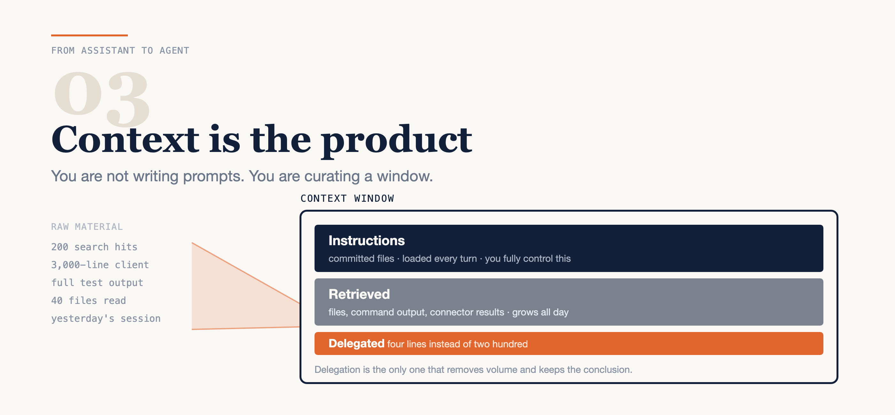

# Your AI Didn't Get Worse. Your Context Did.

### You are not writing prompts. You are curating what is in the window when the model decides.

*Part 3 of* From Assistant to Agent — *a series on running coding agents inside a real, governed codebase. Command names in this post move between releases; check them against your own version rather than trusting a blog post from months ago.*



---

Somebody on your team has said this in the last month:

> "It was great last week. Now it keeps making things up."

Nothing changed about the model. What changed is what was in front of it.

This is the most useful reframe I know for working with coding agents, and it took me embarrassingly long to arrive at: **you are not writing prompts.** You are curating what sits in the context window at the moment the model decides what to do. The prompt is a small fraction of that — often the least important fraction. The rest is instruction files you committed months ago, forty files an agent read because your request was vague, and the residue of a task you finished two hours ago and never cleared.

Almost every complaint I hear about degraded output is a context problem. A bloated session. A stale instruction file. A subagent that read a repository when it needed one function. None of those are fixed by a better prompt, which is why prompt-engineering advice bounces off them.

Here is the model I use instead, the habits that fall out of it, and how to diagnose a bad session in about ninety seconds instead of guessing.

---

## Three sources, one window

Everything the model can see when it decides comes from exactly three places. Naming them is most of the work, because each one has a different failure mode and a different owner.

**Instructions** are the files you commit. The root agent instruction file, per-repository ones, scoped rule files, and whatever the tool has accumulated as automatic memory. These load whether or not you thought about them today. That is their value and their danger: a rule you wrote in March is still shaping decisions in September, and you have stopped reading it.

**Retrieved** context is everything pulled in during the session — files you or the agent read, command output, test results, connector responses. This is the volatile majority of the window, and it is the part that grows without anyone deciding it should. A single `git log` on a busy repository can cost more window than every instruction file you own. Nobody chose that. It accumulated.

The growth is also one-directional, which is the part people underestimate. Instruction files are roughly constant. Retrieved context only ever goes up over a session, until you clear it — so a window that felt spacious at 9am is genuinely crowded by 3pm, on the same machine, with the same model, doing the same kind of work. (If the phrase "context window" is doing a lot of unexplained work here, [post 1](#) covers the mechanics.)

**Delegated** context is the interesting one. It is the summary a subagent hands back *instead of* the raw material. You asked which of six services still call a deprecated endpoint; a separate session burned its own window on two hundred search hits and returned four lines. The two hundred hits never entered your window at all.

Notice the asymmetry, because it is the whole point:

- You **fully control** instructions. They are files. Review them like files.
- You **partly control** retrieved context. You choose the request; the agent chooses much of the reading.
- Delegation is the only mechanism that **removes volume while keeping the conclusion.**

That last line is why I now think of subagents as a context technique rather than a performance trick. They are not primarily about doing two things at once. They are about the four lines you keep instead of the two hundred you don't.

---

## Layer your instructions, narrowest wins

If instructions are the part you fully control, they deserve structure. Four levels, each with a different loading cost:

**1. Workspace root.** The operating boundary, the evidence rules, the commit format, a map of what lives where. This is loaded on **every single turn**, so length has a direct, recurring cost. Treat it like a hot path.

**2. Per repository.** Layer rules, test commands, framework conventions. These belong next to the code they describe so they travel with it — including when someone clones only that repository.

**3. Scoped rules.** Loaded on demand. Anything conditional belongs here. This is the mechanism that lets the root file stay short, and most teams don't use it, which is why their root file is nine hundred lines.

**4. Automatic memory.** What the tool learned on its own. Read it occasionally — genuinely, put it on a calendar. It is context you did not consciously write, shaping decisions you will be asked to defend, and it is the only one of the four levels that changes without a commit. Most of what accumulates there is useful. The problem is the entry that was true in April, is false now, and has never once been re-read.

Narrowest applicable level wins. So a root rule saying "run the test suite before claiming done" is refined by a repository-level file naming the actual command.

Here is what a root file that respects its own cost actually looks like:

```md
# Working agreement

- Start in plan mode for unclear tickets.
- No feature code before requirements, acceptance criteria,
  architecture impact, a test plan, risk and rollback exist.
- Identify the exact nested repository first — the workspace root
  is not a repository.
- Ask before commits, dependency updates, migrations and deploys.
- Tracker, chat and wiki writes stay human-owned.
```

Six rules. That is a complete root file, not an excerpt. Every one of them is unconditional and applies to every task, which is exactly the test for whether something belongs at this level.

Two things about instruction files that took me a while to learn, and that I have not seen written down much:

**A long root file is a tax you pay on every turn.** Not once per session — every turn. Three hundred lines of conditional guidance about a framework you touch on Thursdays is being re-read while you debug something unrelated on Monday. If it is conditional, it goes in a scoped rule.

**Editing your instruction file mid-session may not take effect.** Prompt caching means the version loaded at session start can be the version you are still talking to. I have watched people edit a rule, watch the agent ignore it, and conclude the rule "doesn't work." Restart the session after editing instruction files. This one is worth telling your team out loud, because the failure is completely silent.

---

## Four habits that follow

Once you accept that the window is the product, a handful of habits stop being hygiene advice and start being obvious.

**Open a fresh session per task.** Don't carry yesterday's window into today's ticket. The failure this prevents is specific and I have caused it: an agent that spent yesterday in a repository with one set of conventions confidently applies them to a different repository today, because that reasoning is still sitting in the window looking like established context. It isn't being careless. From inside the window, yesterday's conventions and today's are indistinguishable.

**Delegate anything read-heavy.** If the answer is four lines and the process is four hundred, that process belongs in someone else's window. "Find every caller of this method across the workspace and tell me which ones pass null" is a delegation, not a question.

**Compact deliberately, at a clean boundary — never mid-refactor.** Compaction is lossy by definition; it is a summary standing in for the real transcript. Choosing *when* to take that loss is the entire skill. After a merged change: fine. Halfway through a rename across nine files, with three done and six pending: you have just replaced the precise list of what remains with an approximation of it.

**Precision beats volume.** One exact file beats a repository-wide search. A hundred matches is not context — it is noise with line numbers, and it makes the one relevant match harder to weight, not easier to find. "Read `src/checkout/cart.ts`" is a better instruction than "look into the checkout logic," and it is not close.

---

## Stop guessing, start inspecting

Here is the part that converts all of this from a philosophy into a two-minute diagnosis.

Most tools expose introspection for exactly this. The names differ and they move between versions, so learn the questions rather than the commands:

- **What is currently loaded into context?** The single most useful thing you can ask.
- **Is my environment actually healthy?** A full checkup — versions, configuration, connectors, warnings.
- **What is burning my usage?** Cost and limits, which are a proxy for window size.
- **Which hooks fired?** Because a hook that silently stopped running looks exactly like a model that got worse.
- **Are my connectors up?** A degraded connector returns nothing, and nothing looks like ignorance.

In Claude Code today those are `/context`, `/doctor`, `/usage`, `/hooks` and `/mcp`. Check what your version offers rather than trusting that list.

A real diagnosis, because the abstract version isn't convincing:

Output degrades through the afternoon. The agent starts suggesting patterns from the wrong framework and referencing a file I'm sure we deleted. Old me would have rewritten the prompt, then blamed the model, then switched models — three moves, none of them diagnostic.

Instead: check what is loaded. The session is carrying a 3,000-line generated API client, read two tasks ago for an unrelated question, plus the full output of a test run that has since been fixed. Both irrelevant. Both weighted exactly as heavily as the file I actually care about.

Fresh session. Read the one file that matters. Same request. Fine.

That took ninety seconds and produced a *finding* instead of a feeling. "It got worse" is not actionable. "I am carrying 3,000 lines of dead context" is.

---

## The hard case: a workspace that isn't a repository

One structural situation is worth calling out, because it defeats agents constantly and it is more common than it should be: a folder holding several independent repositories. Monorepo-shaped, but not a monorepo.

```
workspace/            # NOT a git repository
  agent-guidelines/
  web-app/            # own repository + instruction file
  rest-api/
  admin-app/
  mobile-app/
  marketing-site/
  infra/
```

An agent walks into this and infers a single project, because everything about the layout says so. So it branches at the wrong level, or reads across boundaries that should be closed, or runs a test command from the root where no test command exists. This is not a smart-versus-dumb thing. The directory structure is genuinely misleading, and the agent is reading it correctly and concluding wrongly.

Four rules make it a non-issue:

**Branch inside the repository that will change.** Never at the root. The root is not a repository, and the error message when you try is not as clear as you would hope.

**Check status before you start.** In a workspace like this, several checkouts are usually holding active, unrelated work. An agent that doesn't know that will happily attribute your half-finished experiment to today's ticket — and so will a reviewer reading the diff.

**Keep a per-repository instruction file.** Test commands and layer rules live next to the code they describe. This is the difference between "run the tests" resolving to something and resolving to a guess.

**Switch repositories with a fresh session, not by dragging context across.** Moving from the API to the mobile app is a new task with a new window. Treat it that way.

---

## The thing to keep

The model is not the variable you control day to day. The window is.

So when output degrades, don't reach for a better prompt — reach for the three questions. What instructions am I loading whether I meant to or not? What did this session read that it didn't need? And what should I have delegated so it never entered my window at all?

Answer those and most "the AI got worse" conversations end before they start.

---

*Next in the series: **The Readiness Gate Is the Cheapest Bug Fix You Own** — why an agent makes an underspecified ticket more expensive rather than less, and the ten-section checklist that stops it.*
