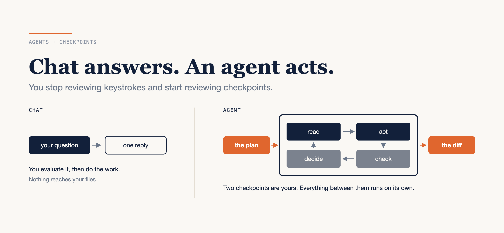

# Chat Answers. An Agent Acts.

### What changes when your AI tool can read your repository, run your tests, and decide what to do next

*Written against Claude Code in September 2026. Flags, mode names and slash commands move between releases; check them against your own version rather than trusting a blog post from months ago.*



---

Same request, two tools.

Into a chat box: "The checkout button submits twice on slow networks." Back comes a debounce helper and a sentence telling you to wire it into your submit handler. You read it, decide whether it's right, find the file, adapt the code, run the tests yourself.

Into an agent running in a terminal opened on your repository: the same sentence. It searches for the submit handler, reads three files and the project's `CLAUDE.md`, proposes a plan and waits. You approve. It edits one file, runs the test command, reads a failure about a fake timer in the spec, fixes that, runs the suite again, and hands you a diff and a suggested commit message.

Same model underneath. Completely different job for you.

Here is the honest version up front: the second one is not valuable because it types faster. It is valuable, and dangerous, for the same reason — it closes the loop between deciding and doing. Chat can be confidently wrong. An agent can be confidently wrong and have already run the command.

That is the whole shift. **You stop reviewing keystrokes and start reviewing checkpoints.**

What follows is where the line actually falls, the six things an agent can reach for, one session walked end to end, how to think about model choice as a cost decision, and the four prompting habits that survive the jump.

---

## The two modes, honestly compared

The difference is not intelligence. It is what happens after the model produces a token.

| | Chat | Agent |
|---|---|---|
| You provide | a question and context | a goal and boundaries |
| It produces | one reply | a sequence of tool calls |
| Reaches your files | no | yes, if you let it |
| Your role | evaluate an answer | approve at checkpoints |
| Fails by | being confidently wrong | being confidently wrong *and acting on it* |

That last row is the one that matters, and it is why the rest of this post is mostly about boundaries rather than capability.

Chat is still the better tool for a large part of the day, and I use it that way. Explaining an unfamiliar error. Drafting an ADR. Arguing through a design before any file exists. Anything where the output is a paragraph you will rewrite anyway, and where reaching your filesystem would buy nothing.

An agent earns its keep when the work is *iterative against real output* — when the right next step depends on what the last command actually printed. That is the category chat structurally cannot do, because you are the one carrying the output back and forth, and you get tired.

---

## Six things an agent can reach for

An agent is a model plus a set of affordances. It is worth knowing what the affordances are, because the failure modes attach to them.

**Tools** are the base layer: read and write files, run shell commands, search the repository, execute tests. The permission tiers matter more than the list. In Claude Code, file reads inside the working directory don't ask; shell commands ask, except a built-in read-only set. Everything downstream in this post is a way of tuning that boundary.

**Subagents** are separate sessions with their own context window, their own tool list and their own model. They live as markdown files in `.claude/agents/`, and the frontmatter is short enough to read in one go:

```markdown
---
name: db-reader
description: Execute read-only database queries
tools: Bash
model: haiku
permissionMode: plan
---

You are a read-only database query specialist...
```

You'd use this when the work is read-heavy and the answer is short: "which of these six services still call the deprecated endpoint" burns a lot of reading and returns four lines. The four lines come back to you; the reading stays in the other window.

**Skills** are packaged procedures. Each one is a `SKILL.md` under `.claude/skills/<skill-name>/`, and the economics are the point: only the frontmatter `description` loads every turn, and the body loads when the skill is invoked. That is the mechanism that lets you commit a two-hundred-line release procedure without paying for it on every unrelated turn.

**MCP connectors** reach outside the repository — issue trackers, databases, internal APIs — over the Model Context Protocol. One command adds one:

```bash
claude mcp add --transport http --scope project tracker https://example.com/mcp
```

`--scope project` writes it to `.mcp.json` in the repository root, so your team gets the same connector from the checkout. A server exposes tools, resources and prompts, all discovered when it connects. The gotcha is silent: a degraded connector returns nothing, and nothing looks exactly like the agent not knowing.

**Hooks** are the deterministic layer, and they are the part most teams skip and then wish they hadn't. A hook is a shell command wired to a lifecycle event — `PreToolUse`, `PostToolUse`, `SessionStart`, `Stop` and about thirty others — configured in `.claude/settings.json`:

```json
{
  "hooks": {
    "PreToolUse": [
      {
        "matcher": "Bash",
        "hooks": [
          { "type": "command", "command": "${CLAUDE_PROJECT_DIR}/.claude/hooks/block-rm.sh" }
        ]
      }
    ]
  }
}
```

A `PreToolUse` hook that exits with code `2` blocks the call. This is the distinction worth internalising: your instruction file is *context*, which the model weighs against everything else in the window, and a hook is *enforcement*, which runs whatever the model decided. The documentation says it plainly: "To block an action regardless of what Claude decides, use a PreToolUse hook instead." If a rule in your `CLAUDE.md` is one you would be upset to see broken, it belongs in a hook or a deny rule, not in prose.

**Git awareness** is the last one and the most quietly useful. The agent reads history, understands the branch it is on, and drafts commit messages and PR bodies that describe the change rather than the files. The merge stays human. So does the push, if you write it down:

```json
{ "permissions": { "deny": ["Bash(git push *)"] } }
```

---

## One session, five phases

Take a ticket. `PROJ-1234`, "checkout submits twice on slow networks", against `web-app`. The loop has five phases, and the interesting thing about them is where the human sits.

**1. Understand.** It reads the ticket, greps for the submit handler, opens the two files that actually matter and the project's `CLAUDE.md`. No edits yet. This phase is cheap and you should let it run.

**2. Plan.** For anything non-trivial, plan mode is the whole game. Press `Shift+Tab` to cycle into it, or prefix one prompt with `/plan`, or start the session there:

```bash
claude --permission-mode plan
```

In plan mode the agent reads files and runs read-only shell commands but does not edit your source, and edits stay blocked until you approve the plan. When the plan is ready you get three choices — approve and let it run, approve and review each edit, or keep planning and tell it what to change. `Ctrl+G` opens the plan in your editor so you can fix it directly instead of describing the fix.

This is the cheapest place in the session to redirect it, and it is the place I have most often wasted. I have approved a plan I skimmed, watched it touch nine files, and spent forty minutes unpicking a change I could have killed in one sentence at the prompt. Read the plan. It is six lines.

**3. Implement.** Edits, then commands, then edits informed by what the commands printed. The valuable part is the third clause: it iterates against real test output rather than against its own prediction of the output. This is where an agent stops being autocomplete.

**4. Verify.** It runs the suite and the linter, re-reads its own diff, and reports what it ran. Hold the line here: "done" is not a claim, it is five claims — it compiles, the tests pass, the linter is clean, the diff is what you intended, and nothing unrelated moved. Ask for the command and its output, not the adjective. An agent that says "all tests pass" without a paste is a chat reply wearing a terminal.

**5. Hand off.** A diff, a commit message, a PR body. You review and you merge.

Four of the five phases run without you. The two places you actually intervene are the plan and the diff — which is the practical meaning of reviewing checkpoints instead of keystrokes.

---

## Choosing a model is a cost decision, not a leaderboard

The question is never "which model is best." It is "what is this task worth per token." List prices, from Anthropic's model documentation as of September 2026:

| Model | Input / MTok | Output / MTok | Context | Positioning |
|---|---|---|---|---|
| Claude Haiku 4.5 | $1 | $5 | 200K | fastest, near-frontier |
| Claude Sonnet 5 | $2 | $10 | 1M | speed and intelligence |
| Claude Opus 5 | $5 | $25 | 1M | complex agentic coding |
| Claude Fable 5.1 | $10 | $50 | 1M | demanding, long-horizon |

Ten times, top to bottom. That spread is the actual decision: a mechanical, high-volume pass — renaming across a directory, summarising log output, a read-only lookup subagent — runs on the cheap end and the quality difference is invisible. A long-horizon refactor across a service you don't know well is where the expensive end pays for itself.

Two things make this cheaper than the table suggests. Subagents take a `model:` field, so the expensive session can dispatch the boring reading to a cheap one. And prompt cache reads cost 10% of the base input price, which is why a long session on one repository is not priced like a long session against fresh context.

Set a default, override per task, and check the numbers yourself before quoting mine — pricing pages move faster than blog posts.

---

## Four habits that survive the jump

Most prompting advice you have read still applies. It just stops being about phrasing and starts being about specification. Four are worth the ink.

**1. Specify the outcome, not the vibe.** "Improve the checkout flow" gives it nothing to verify against. "The checkout button submits twice on slow networks — add a debounce and a regression test that fails without it" gives it a finish line it can check itself against.

**2. Give context, not only instruction.** It can search your repository. It cannot know that the retry logic was deliberate, that the flaky spec is a known issue, or that the endpoint is being deprecated next quarter. Say the thing you would say to a new colleague.

**3. Ask for a plan on anything multi-part.** Same reason as above, and it costs one keystroke.

**4. Show the shape you want.** One example of the output format — a commit message, a test, an interface — outperforms three paragraphs describing it.

Then the guardrails, which are short and non-negotiable. No secrets or customer data in a prompt. No unattended destructive commands: put them behind a deny rule or a hook, because an instruction file is advice and a deny rule is a wall. And everything generated is a draft until a human has read it, including — especially — the parts that look boring.

---

## The thing to keep

Chat gives you an answer. An agent gives you a process, and the process runs whether or not you are watching it.

So the skill that matters is not prompt phrasing. It is designing where the checkpoints go: which commands are denied outright, which actions fire a hook, which procedures are committed as skills instead of retyped, and which two moments in the session you actually read carefully.

Do one thing this week. Open the repository you know best, run one real ticket through an agent in plan mode, and write down every point where you had to intervene. If you intervened more than twice, the gap is almost always a missing `CLAUDE.md` line or a missing deny rule — an hour of work, once, that you stop paying for every session after.

---

### Sources

- [Permission modes](https://code.claude.com/docs/en/permission-modes) — Anthropic
- [Configure permissions](https://code.claude.com/docs/en/permissions) — Anthropic
- [Hooks reference](https://code.claude.com/docs/en/hooks) — Anthropic
- [Subagents](https://code.claude.com/docs/en/sub-agents) — Anthropic
- [Agent Skills](https://code.claude.com/docs/en/skills) — Anthropic
- [Model Context Protocol in Claude Code](https://code.claude.com/docs/en/mcp) — Anthropic
- [How Claude remembers your project](https://code.claude.com/docs/en/memory) — Anthropic
- [Models overview](https://platform.claude.com/docs/en/about-claude/models/overview) — Anthropic
