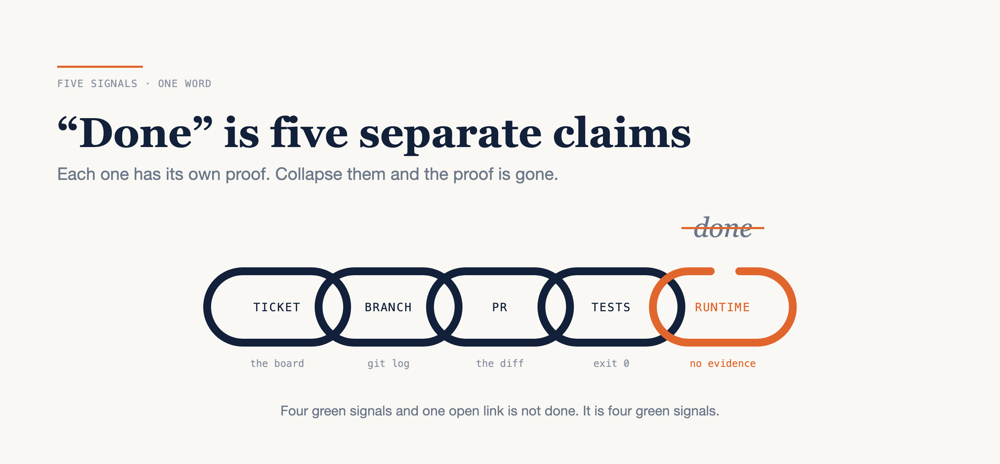

# "Done" Is Five Separate Claims

### The failure mode where an agent reads feature code and reports "shipped" — and the evidence standard that makes that impossible to say by accident.

*Written against the coding agents I use daily, in September 2026. Command names, plan gates and availability move between releases, so check them against your own version rather than this post. Repository, script and ticket names are changed; the failure mode and the artefacts are as they happened.*



---

I asked an agent where a ticket stood. It went and looked. It found the branch, read the diff, saw a complete and sensible implementation of the feature, and came back saying the work was shipped.

The ticket was still In Progress. The branch had never been merged. Nothing was deployed. And by then the summary had been forwarded to somebody who does not read diffs.

Nobody lied. The agent saw feature code in a branch that looked current and inferred delivery from it. That is a reasonable inference — it is the same one a human makes skimming a repository at speed, and it is wrong for exactly the same reason.

So the fix is not a better prompt. You cannot prompt your way out of an inference that was locally reasonable. The fix is structural: **"done" is not a status, it is five separate claims, and each one has its own proof.**

Here is what those five claims are and what each one fails to prove, why the test matrix has to be written before the implementation rather than after it, what a review pipeline looks like once you accept that the reviewing is the cheap part, and the seven fields that turn "this looks risky" into something a person can act on.

---

## Five signals, one word

Everything anyone means by "done" is assembled from five signals. They are produced by different systems, at different times, by different people, and they fail independently.

| Signal | Proves | Does not prove |
|---|---|---|
| Ticket status | what a human recorded, and when | that any code exists |
| Branch | where the work lives | that it is reviewed, merged, or on the base you assume |
| PR or commit | the actual diff and its target branch | that it passes anything |
| Test run | which commands ran and what they returned | that any of it is deployed |
| Runtime | image tag, pod or job state, an endpoint response, a log line | that anyone has accepted it |

Every entry in the right-hand column is a gap somebody has fallen into. A ticket moved to Done by a project manager clearing a board proves nothing about code, and a deployed image proves nothing about whether the person who asked for the feature thinks they got it.

The failure in the lede is the second row misread as the fifth. That is the common one, because a branch containing finished-looking code is the most convincing artefact in the whole list and the weakest evidence in it.

So I changed the shape of the answer rather than the prompt asking for it:

```
PROJ-1234
  ticket    In Progress (last moved 3 days ago)
  branch    feat/PROJ-1234-refund-window, 4 commits ahead of origin/main
  PR        none
  tests     not run
  runtime   not deployed
```

Six lines, and the question answers itself. Nobody forwards that to a stakeholder as "shipped". Collapse it into one word and the information that mattered — `PR none`, `tests not run` — is not softened, it is *gone*.

Three rules fall out of the table.

**Never collapse them.** Report the five separately, always, including when all five are green. The discipline has to be unconditional, because the moment it is applied only to suspicious cases, somebody has to decide which cases are suspicious, and that decision is exactly the inference you were trying to remove.

**Low-confidence items stay out of business summaries** until a human has confirmed them. The engineering channel can carry "probably deployed, the job log is ambiguous." The summary that reaches the person making a commitment to a customer cannot.

**On failure, name the failing layer, keep the partial evidence, and return the partial result.** This is the rule that separates a useful agent from an irritating one, and nobody thinks to ask for it. "It didn't work" throws away four signals in order to report the fifth. The output you want looks like this:

```
tests     214 passed, 0 failed
deploy    BLOCKED — staging job exited 1, missing PAYMENTS_WEBHOOK_SECRET
          log: 2026-09-15 09:41:12 FATAL config: required key absent
ticket    unchanged
```

Four of the five signals are still there. The failure has a layer, a cause and a line you can grep for. That is a result. "It didn't work" is a feeling with a verb in it.

---

## Tests are the contract, not the receipt

Almost everyone asks for tests after the implementation. Do that and the tests are a receipt: they describe whatever happened to get written, which means they pass by construction and prove nothing except that the code is self-consistent.

Ask for the matrix *first* and it becomes a contract the implementation has to satisfy. Same tokens, completely different artefact, and it costs one extra sentence in the request.

Four layers, each with what belongs in it and what an agent gets wrong without it.

**Unit** — pure logic, validators, mappers, guards, controller wiring, form configuration. Generated alongside the change, never afterwards. Without this layer, an agent refactors a validator and the only evidence it still rejects bad input is that the agent says so.

**Integration** — authorisation on endpoints (401 versus 403, and the cross-account case), repositories against a real schema, scheduled jobs and CLI entry points, adapters against fakes. Required for any endpoint or data change, no exceptions. This is where the inference habit is most expensive: an agent reading a controller with an `@PreAuthorize` annotation on it will tell you the endpoint is protected. The annotation is not the proof. The 403 is.

**Regression** — one narrow test per bug you have already paid for once. Keep the categories explicit so the agent has somewhere to aim: handoffs between systems, lifecycle state transitions, entitlement and subscription state, accidental public exposure, and parity between platforms that are supposed to behave identically.

**End-to-end and manual** — full workflows across UI, API, auth and external services. The requirement here is not coverage, it is honesty: name the manual-only gaps in writing. A QA note saying "payment provider callback is not covered automatically, verify by hand" is worth more than a suite that quietly pretends otherwise.

Now the paragraph that matters more than the four layers put together. **The negative cases are where the bugs are, and an agent will not write them unless you ask.** Asked for "tests", it writes the happy path. Asked for the negative cases, it writes the ones that find things. Two risks in particular show up only in tests you deliberately request: cross-account authorisation, where user A can read user B's data through an endpoint that is correctly authenticated and incorrectly scoped, and a public endpoint returning more fields than anyone intended.

So the request has a shape:

```
Write the integration test matrix for PROJ-1234 first. List the negative
cases — unauthenticated, authenticated-but-wrong-account, missing required
field, oversized payload. Then implement the narrowest change that passes it.
```

And one standard for when the tests genuinely cannot run — no environment, no credentials, hardware in the path. State exactly which layer could not execute and why, and supply the manual QA steps that substitute for it. "Should work" is not an accepted output. It is the same word as "shipped", wearing a hedge.

---

## Review is a pipeline, and the reviewing is the cheap part

Three tiers, in the order you should reach for them.

**The in-session pass on your own diff.** In Claude Code this is `/code-review`, which reviews your branch's commits ahead of upstream plus whatever is uncommitted; `--fix` applies the findings, `--comment` posts them on a pull request. It runs as a background subagent with its own context window, so a long review does not crowd out the session you are working in. Its effort level is a dial from `low` to `max`, where the low end reports only what it is most confident about and the high end broadens coverage at the cost of including findings it is less sure of. That dial is an evidence decision — pick which error you would rather have *before* you run it, not while reading the output.

**The deeper multi-agent pass.** The shape is worth knowing even if you build your own: several agents each look for a different class of issue in parallel, then a separate verification step checks every candidate against actual code behaviour before it is allowed to be reported. Find, then adversarially verify — this whole post applied to the reviewer. Anthropic's managed Code Review works that way on GitHub pull requests, and it is in research preview on Team and Enterprise plans only, unavailable to organisations running zero data retention, so check what your plan has before designing a process around it.

Its customisation guidance suggests a rule it calls a *verification bar*: a behaviour claim "needs a `file:line` citation in the source", not an inference from naming. Which is the vendor telling you, in its own documentation, that the reviewer will infer from naming unless you forbid it.

**A committed reviewer with no edit tool.** A subagent definition living in the repository, with read and search tools and nothing that writes. Removing the edit tools is editorial rather than security: a reviewer that can edit will edit, and the finding disappears into a diff instead of into a sentence somebody reads. Take the writing tools away and the only move left is to write it down.

Underneath all three is the boring part that makes them reproducible. Before any reviewing happens, a script assembles the bundle:

```
scripts/prepare-review.sh --repo web-app --target origin/main
# writes .review/2026-09-15T0914/web-app/
#   metadata.txt  status.txt  diffstat.txt
#   changed-files.txt  branch-commits.txt
#   diff.patch  review-prompt.md
```

Two runs a week apart now compare, because the inputs are on disk — and the base is written down instead of assumed, which closes the first of two traps that produce confidently wrong reviews:

- **A stacked PR reviewed against the wrong base.** Review branch three against `main` and you have attributed every change from branches one and two to whoever wrote three. The review will be articulate and entirely about someone else's code.
- **Treating the PR description as evidence.** It is a claim to verify, not a source. `status.txt` is there for the same reason — read it first, and do not mistake your own dirty worktree for the change under review.

Then rank findings in one fixed order, so nothing important sits below a style note: behavioural regressions, security and trust-boundary changes, missing tests, manual QA gaps, and traceability — a change with no ticket key is one nobody can explain in six months.

---

## A security finding needs a shape

"This looks risky" is unactionable, and worse, it is unfalsifiable. Seven fields, each present because its absence produced a bad decision.

1. **Attack path** — the sequence, from an unauthenticated request to the thing you care about. Without it you cannot distinguish a finding from a smell.
2. **Preconditions** — what must already be true. "Requires an authenticated user in a different account" and "requires nothing" are the same severity and completely different tickets.
3. **Severity** — the impact if it is exploited, on whatever scale your team already uses.
4. **Confidence** — how sure the reviewer is that this is real.
5. **Files and lines** — the citation. A finding with no line number has not been verified against code, it has been inferred from a name, and you now know how much that is worth.
6. **Suggested fix** — the narrowest change that closes it.
7. **Validation test** — the test that fails now and passes afterwards. This is the field that stops a security fix from being one more claim.

**Confidence is the field everyone skips and the one reviewers need most.** A high-severity, low-confidence finding is absolutely worth writing down, and it must not go anywhere near a business summary. Without the field those two states are indistinguishable, so a team either panics at everything or learns to ignore the reviewer.

Some surfaces are high risk by default and should be reviewed as such no matter how small the diff looks: public endpoints, authentication and authorisation flows, payments and subscriptions, file uploads and downloads, admin actions, third-party integrations, and anything that renders CMS content or loads third-party code into a browser. Add prompt injection and supply chain wherever your code fetches remote scripts or proxies an AI service: a dependency that can change under you is a trust boundary whether or not it is drawn on the diagram.

On tooling, briefly: `/security-review` runs an ad-hoc pass over the pending diff for injection, cross-site scripting, authentication and authorisation flaws, insecure data handling and dependency issues. The same thing exists as a GitHub Action at `anthropics/claude-code-security-review`, with filtering rules so the false-positive rate does not train your team to close the tab.

---

## Installing the standard in five steps

None of this is a rewrite. It is five small artefacts, and you can have four of them by Friday.

### 1. Put the five-line status format in your instruction file

One block, in the file the agent loads on every turn. Name the five signals and state that they are never collapsed. Ten minutes, and it is the change that would have caught the failure in the lede.

### 2. Ask for the matrix before the change, on the very next ticket

Use the request shape above verbatim, including the word "negative", then compare the matrix against what you would have written yourself. That comparison is the cheapest audit of your own test standards there is.

### 3. Build the review bundle script

An hour or two. It shells out to `git`, writes seven files into a timestamped directory, and does no reviewing at all. Add `.review/` and any ticket cache such as `.ticket-cache/assigned/` to `.gitignore` — a generated bundle is evidence, not source.

### 4. Give security findings the seven fields

A template in the repository, next to the reviewer definition. The field to fight for is `confidence`, because it is the one people quietly drop as bureaucracy.

### 5. Gate on a number, not on a summary

Anthropic's managed reviewer deliberately completes its check run with a neutral conclusion so it can never block a merge through branch protection. If you want a gate, you read the count yourself:

```bash
# find the check run id for the commit
gh api repos/OWNER/REPO/commits/<sha>/check-runs --jq '.check_runs[] | {id, name}'

# read its severity counts
gh api repos/OWNER/REPO/check-runs/CHECK_RUN_ID \
  --jq '.output.text | split("bughunter-severity: ")[1] | split(" -->")[0] | fromjson'
```

That returns something like `{"normal": 2, "nit": 1, "pre_existing": 0}`, and `normal` is the count of findings worth fixing before merge. A number your CI can compare against zero is a gate. A paragraph a human skims is not.

Cost, honestly: steps 1, 2 and 4 are under an hour of writing between them. Step 3 is an afternoon. Step 5 depends entirely on what your plan includes — that managed review averages $15–25 per pull request and about twenty minutes, billed separately from your plan's usage, which is a real number to take to whoever owns the budget rather than a detail to discover later.

---

## What the standard actually buys

None of this is distrust, whatever "evidence standard" sounds like. The bottleneck on delegating real work was never capability — it was that checking the output cost about as much as doing it, so the sensible move was to keep the work. Change what comes back and the arithmetic changes with it: a claim you can check in ten seconds is a claim you do not have to re-do.

So take the last three tickets someone called done and write the five lines for each. Not from memory — go and look. Count how many of the fifteen signals you can verify in under two minutes.

Twelve or more and your process already works; leave it alone. Below five, and the problem was never the agent's honesty. It is that one word was carrying five claims, and nobody had ever asked it to stop.

---

### Sources

- [Code Review](https://code.claude.com/docs/en/code-review) — Claude Code documentation: the `/code-review` command, effort levels, the find-then-verify review shape, `REVIEW.md` customisation, severity levels, pricing and the check-run severity query.
- [Automated security reviews in Claude Code](https://support.claude.com/en/articles/11932705-automated-security-reviews-in-claude-code) — Anthropic support: `/security-review`, the vulnerability classes it covers, and the `anthropics/claude-code-security-review` GitHub Action.
- [Automate security reviews with Claude Code](https://claude.com/blog/automate-security-reviews-with-claude-code) — Anthropic.
- [Subagents](https://code.claude.com/docs/en/sub-agents) — Claude Code documentation: subagent definitions, and the tool allowlist used to build a reviewer that cannot edit.
