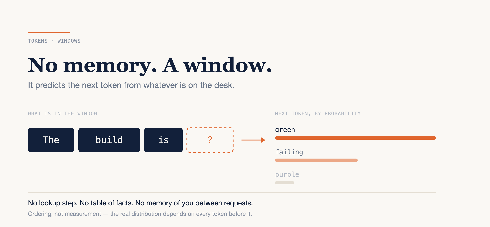

# Your LLM Has No Memory. It Has a Window.

### Tokens, context windows, and the one distinction that explains most of your frustration.

*Written in September 2026, checked against the current Claude documentation. Context window sizes and tokenizers change with every model generation; the three mechanics below have not.*



---

You paste a stack trace into a chat window. Back comes a confident, well-formatted answer naming a helper in your codebase and explaining exactly why line 41 blows up. The helper does not exist. You lose twenty minutes looking for it before you accept that.

> "It just made one up."

It did, and nothing malfunctioned when it did. That is the part worth taking literally. The model wasn't consulting your repository and getting it wrong. It was never consulting anything. It was continuing your text with the likeliest next thing, and in a stack trace from a Java service, a plausible-looking helper name is a very probable continuation.

**An LLM has no database of facts and no memory of you — it predicts the next token given everything in front of it.** Believe that sentence literally and most of the complaints I hear stop being mysterious. It got dumber. It forgot what we agreed. It was better last week. All of those become diagnosable.

Three mechanics do the whole job: next-token prediction, tokens, and the context window. Here is each one, what it costs you when you ignore it, and the three habits that fall out.

---

## It predicts the next token. That is the entire mechanism.

Anthropic's own glossary describes the underlying models as "pretrained to predict the next word, given the previous context of text in the document." That is not a simplification for beginners. It is the mechanism.

The model reads everything in front of it, produces a distribution over what comes next, picks from it, appends that, and reads the whole thing again. One token at a time, all the way to the end of the answer.

```text
"The build is ..."
   green      ← high probability
   failing    ← lower, still ordinary
   purple     ← vanishingly unlikely

# The ordering is the claim. The actual numbers depend on the model
# and on every token that came before this line, so I am not going
# to invent three percentages and present them as measurements.
```

There is no lookup step anywhere in that loop. Nothing is retrieved from a table of facts, and nothing checks the answer against your repository unless you gave it a tool and it chose to use it.

Which gets you the one line I would keep if I could keep only one: fluency and correctness are unrelated properties. A wrong answer is not a failure mode. It is a high-probability continuation that happens to be false, produced by exactly the same process as the right answers you got an hour ago.

The practical version is cheap. Verify anything that matters, and prefer questions whose answers cost you seconds to check. The invented helper above dies in one command:

```bash
rg "formatDuration" src/
```

Ten seconds, and you never spend the twenty minutes.

---

## Tokens: the unit it reads in, and the unit you pay in

The model does not read words. It reads tokens — subword chunks. Anthropic's glossary puts the rate plainly: "For Claude, a token approximately represents 3.5 English characters, though the exact number can vary depending on the language used."

Treat that as a rule of thumb and nothing more, because two things quietly break it.

**Structure costs tokens too.** The documented token-counting example sends a system prompt of "You are a scientist" and a message of "Hello, Claude" — 32 characters of actual text — and comes back with `{"input_tokens": 14}`. The framing around your content is content.

**Tokenizers change under you.** The token counting docs note that Claude 4.7 and later models use a newer tokenizer, and that the same input text produces "approximately 30 percent more tokens" than on earlier models. A budget you measured last year against an older model is not a budget any more.

So don't estimate. The endpoint is free and gives you the real number for the thing you are about to send:

```bash
curl https://api.anthropic.com/v1/messages/count_tokens \
  -H "x-api-key: $ANTHROPIC_API_KEY" \
  -H "content-type: application/json" \
  -H "anthropic-version: 2023-06-01" \
  -d '{"model": "claude-opus-5",
       "messages": [{"role": "user", "content": "Hello, Claude"}]}'
```

Point it at the 3,000-line file you were about to paste into `rest-api`'s session and you will stop pasting whole files. That is the entire lesson of this section.

---

## The context window is a desk, not a brain

The context window is "the amount of text a language model can look back on and reference when generating new text," and — the part people skip — "this is different from the large corpus of data the language model was trained on." It is working memory for one request. A finite surface, and you decide what is on it.

Everything in the request takes up space on that desk: the system prompt, every message in the conversation, tool results, images, attached documents, and the definitions of the tools themselves. You don't have to guess at the total, either — every response reports what the request actually consumed in its `usage` field:

```json
"usage": { "input_tokens": …, "output_tokens": … }
```

Watch that first number climb across a long session and the rest of this section stops being theoretical. Two misconceptions die here, and both are expensive.

**"It remembers our last conversation."** It does not. What happens instead is re-supply: each turn, the whole history goes back over the wire, and, as the docs describe it, "previous turns are preserved completely." Continuity is something the client does for you by re-sending, not something the model holds between requests. It took me longer than I would like to stop correcting a model in-session and expecting the correction to survive into tomorrow.

**"A bigger window means I can stop thinking about what I paste."** Also no, and you don't have to take my word for it — the vendor documents the downside of its own headline number: "As token count grows, accuracy and recall degrade, a phenomenon known as *context rot*." Forty irrelevant files do not sit politely in the corner. They make the one relevant file harder to weight.

So the window is the thing you curate. Not a setting you raise once, a habit you keep.

---

## Training happened once. Your session is not training.

Pretraining is a past event against a fixed corpus. Inference is the live conversation. Nothing you type in a session updates any weights — adapting a model to your patterns is fine-tuning, a separate and deliberate process that is not what happens when you correct it in chat.

Two consequences follow, and they are the ones that actually cost teams time:

- The model does not know your repository, your incident from last Tuesday, or a library released after its training data ends. If it needs any of that, you put it in front of it.
- Correcting it in conversation fixes *this* window and nothing beyond it. The durable version of a correction is a file you commit — `CLAUDE.md` at the repository root, or a per-directory one next to the code it describes — so it gets re-supplied on every future session instead of re-explained.

---

## Three habits that follow this week

### 1. Start a fresh session when the task changes

Moving from `web-app` to `rest-api` is a new task, not a new paragraph. Carrying the old window across buys you nothing and costs you accuracy. The price of a clean start is re-pasting two or three files — call it a minute, against a session that has been quietly degrading since lunch.

### 2. Count before you paste

Run `count_tokens` on the file, the log dump or the diff you were about to drop in. Do it three times and you will develop an instinct for what a 200-line diff actually costs, which is the point.

### 3. Re-supply deliberately instead of hoping for memory

Anything you have explained twice belongs in `CLAUDE.md` next to the code, not in a message you will retype next Thursday.

---

## The thing to keep

The model is not reasoning over your codebase and occasionally slipping. It is predicting the next token from whatever is on the desk, every single time, including the times it is right.

That is a better mental model than "it got worse," and it is the one that gives you something to do. The next time an answer looks wrong, don't reach for a better prompt — scroll up and read what is actually in the window. If you cannot say in ninety seconds what the model is looking at, it is looking at too much. Start a new session and put back only the three things the task needs.

---

### Sources

- [Glossary](https://platform.claude.com/docs/en/about-claude/glossary) — Anthropic (tokens, context window, pretraining, fine-tuning)
- [Context windows](https://platform.claude.com/docs/en/build-with-claude/context-windows) — Anthropic (what counts toward the window, progressive accumulation, context rot)
- [Token counting](https://platform.claude.com/docs/en/build-with-claude/token-counting) — Anthropic (the endpoint, the worked counts, the tokenizer change)
