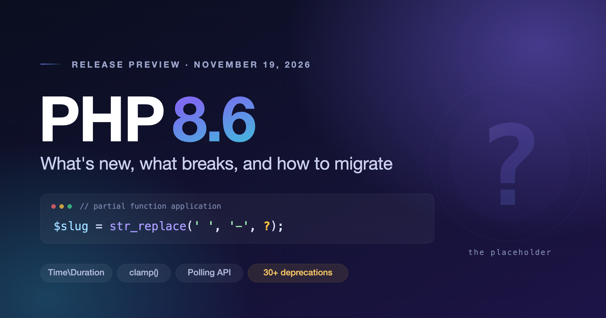

# PHP 8.6 Is a Small Release With a Big Warning Label

### Partial function application, `Time\Duration`, and a deprecation list that is really PHP 9.0 preparation

*Written against PHP 8.6 beta 3. The feature set is frozen, but I'll note anything that shifts before GA.*



---

PHP 8.6 lands on **19 November 2026**, and the diff is smaller than 8.5's. There is no JIT, no property hooks, no union types — nothing that will reshape how you write a class.

So here is the honest version, up front: upgrading to 8.6 will take you an afternoon. Getting *clean* on 8.6 is how you avoid a painful PHP 9.0.

Three things are worth your attention. **Partial function application** is a genuinely good language feature and the missing half of last year's pipe operator. **`Time\Duration`** is a small class that quietly fixes a design mistake the standard library has been making for twenty years. And roughly **thirty deprecations** are the real story of this release — not noise, but a readable map of where the language is going next.

Let's go through all three, and then the migration playbook.

---

## The headline: partial function application

This is the feature people will actually talk about, and it passed **33 to 0** — unanimous, which almost never happens for syntax.

The idea: call a function, but leave some arguments blank. You get back a closure that wants the rest.

```php
$makeSlug = str_replace(' ', '-', ?);

$makeSlug('Hello World');   // 'Hello-World'
```

There are two placeholders. `?` stands for exactly one argument at that position. `...` stands for "all the remaining parameters, whatever they are."

```php
function stuff(int $i1, string $s2, float $f3, Point $p4, int $m5 = 0): string {}

// ... keeps the tail of the signature intact
$c = stuff(1, 'hi', ...);
// fn(float $f3, Point $p4, int $m5 = 0): string

// mix bound values and placeholders freely
$c = stuff(1, ?, 3.5, ...);
// fn(string $s2, Point $p4, int $m5 = 0): string
```

Named placeholders are the part I didn't expect. They let you *reorder* the resulting closure's signature, which turns out to matter a lot when you're feeding a callback into an API that dictates argument order:

```php
$c = stuff(s2: ?, i1: ?, p4: ?, f3: 3.5);
// fn(string $s2, int $i1, Point $p4): string
```

### Why this matters now

Because PHP 8.5 gave us the pipe operator, and pipes without partial application are frustrating in a very specific way. Almost every useful transformation takes more than one argument, so you end up wrapping everything:

```php
// PHP 8.5: the pipeline is drowning in arrow functions
$result = $input
    |> fn($s) => trim($s)
    |> fn($s) => str_replace(' ', '-', $s)
    |> fn($s) => mb_strtolower($s)
    |> fn($s) => mb_substr($s, 0, 50);
```

```php
// PHP 8.6: the pipeline is the code
$result = $input
    |> trim(?)
    |> str_replace(' ', '-', ?)
    |> mb_strtolower(?)
    |> mb_substr(?, 0, 50);
```

That second block is why I care about this release. Point-free style has been available in PHP for years if you were willing to write `Closure::fromCallable()` and a pile of adapters; now it's just how you write a pipeline.

### The gotcha that will bite someone on your team

Arguments in a partial are evaluated **immediately**, when the partial is created — not when it's called. Arrow functions defer. These two lines look equivalent and are not:

```php
$partial = speak(?, getArg());               // getArg() runs NOW, once
$arrow   = fn($who) => speak($who, getArg()); // getArg() runs on every call
```

If `getArg()` reads a request, a clock, or a mutable container, you have two different programs. Bind eagerly on purpose, or use an arrow function.

### The limits

Partial application does not work on `new` (use a static factory instead), on `__get`/`__set` (they aren't invoked as methods, so there's nothing to partially apply), or on functions whose whole job is reading the calling scope — `compact()`, `extract()`, `func_get_arg()`, `get_defined_vars()`. Changing that scope is the entire point of PFA, so those were never going to work.

One syntax rule to remember: a positional `?` after a named argument is a fatal error, not a warning.

And it's worth knowing how this differs from first-class callables, which arrived in 8.1. `foo(...)` produced a reference to the function *as it is*. PFA builds a **new** closure with arguments baked in. Practically, that means attributes no longer travel: FCC copied all of them, a partial preserves only `#[\NoDiscard]` and `#[\SensitiveParameter]`. If you're doing anything reflective with attributes on callables, check that assumption.

---

## `Time\Duration`: fixing a twenty-year-old API smell

Quick quiz on the standard library. `sleep()` takes seconds. `usleep()` takes microseconds. `stream_set_timeout()` takes seconds and microseconds as two arguments. `curl_setopt()` has `CURLOPT_TIMEOUT` in seconds and `CURLOPT_TIMEOUT_MS` in milliseconds. Redis clients take floats. Nobody has ever gotten all of these right from memory.

PHP 8.6 introduces `final readonly class Time\Duration` (voted **35 to 1**) so that a timeout can carry its own unit:

```php
use Time\Duration;

$halfSecond = Duration::fromMilliseconds(500);
$combined   = Duration::fromSeconds(1)->add($halfSecond);

// exponential backoff that reads like exponential backoff
$delay = $baseDelay->multiplyBy(2 ** $attempt);
```

The factories cover what you'd expect: `fromNanoseconds()`, `fromMicroseconds()`, `fromMilliseconds()`, `fromSeconds(int $s, int $ns = 0)`, `fromMinutes()`, `fromHours()`, and `fromIso8601DurationString()`. Instances give you `add()`, `sub()`, `multiplyBy(int)`, `divideBy(int)`, `negate()`, `absolute()`, and a static `compare()`, plus readonly `$seconds`, `$nanoseconds` and `$negative` properties.

Two design decisions are worth calling out, because they're what makes this good rather than redundant.

It's a **stopwatch, not a calendar**. There are no months, no years, no DST. That's deliberate: a duration of "one month" is meaningless without a starting date, which is `DateInterval`'s job. `Duration` is for "wait this long," and by refusing to model calendar arithmetic it avoids being ambiguous.

And it's **infrastructure, not sugar**. In 8.6 the first core consumer is `IO\Poll\Context::wait(?Time\Duration $timeout)`. That's a thin start, and the value isn't the method list — it's that every timeout-taking API written from here on has one obvious type to accept, in core, with no dependency. Expect framework and client libraries to accept `Duration` alongside their existing int/float parameters within a release or two.

*One thing to verify at RC: which existing core functions accept a `Duration` in the shipped build. This moved during development and the early write-ups disagree with each other.*

---

## The async plumbing nobody will call directly

PHP 8.6 ships a low-level I/O multiplexing API — `IO\Poll\Context`, `StreamPollHandle`, `Event::Read`:

```php
$context = new IO\Poll\Context();
$context->add(new StreamPollHandle($stream), [Event::Read], ['type' => 'server']);

$watchers = $context->wait(Duration::fromSeconds(1));
```

Let me be blunt about the audience: your application code will never touch this. It matters anyway. ReactPHP, Amp, Swoole and the FrankenPHP-style runtimes each currently reimplement event polling on top of `stream_select()` or their own extension, with different edge-case behaviour and different platform support. A primitive in core is how "async PHP" stops being a set of mutually incompatible dialects and becomes a property of the runtime.

That's a five-year payoff, not a 8.6 one. Worth noting and moving on.

---

## The rest of the good stuff

Scannable, because none of these need a section of their own:

- **`clamp()`** — `clamp(101, min: 0, max: 100)` gives `100`. Works on strings too: `clamp("a", "x", "z")` gives `"x"`. Everyone has written this helper; now you can delete it.
- **Readonly properties can have defaults** — long overdue, and it matters most when you're implementing interface property hooks.
- **`#[\Override]` for class constants** — the 8.3 attribute keeps expanding. 8.5 gave it properties, 8.6 gives it constants.
- **`enum SortDirection { Ascending; Descending; }`** — a built-in replacement for the `SORT_ASC`-shaped integer constants that every project re-declares.
- **Debuggable enums** — enums can implement `__debugInfo()`.
- **Doc comments on parameters** — `function store(/** @param Book[] */ array $books): void {}`. Tiny syntax change, real win for static analysis on array shapes.
- **Better errors** — errors now display function arguments, and `json_decode()` tells you *where* the parse failed. Pure debugging quality of life, and the kind of thing you appreciate at 2am.
- **Reflection** — `isReadable()` and `isWriteable()` on properties, scope-aware.
- **Closure optimizations** — free performance. I haven't benchmarked it, so I won't quote a number at you.
- **`pack()`/`unpack()` endianness modifiers** — `<` and `>` now work for floats and signed integers. Niche, but if you speak binary protocols it deletes a lot of hand-rolled byte swapping.

Also landed: `grapheme_strrev()`, `mysqli_quote_string()`, `Locale::getDisplayKeyword()`, `IntlNumberRangeFormatter`, TLS session resumption and 0-RTT early data for streams, `Pdo\Pgsql::ATTR_CHUNK_SIZE` for lazy row fetching, `gmp_powm_sec()` and `gmp_prevprime()`, `finfo_file()` over remote streams, and URI builder classes following up on 8.5's RFC 3986 / WHATWG URL work.

---

## What didn't make it

The rejections tell you as much as the acceptances.

- **Pipe assignment operator** (`|>=`) — declined, one year after pipes themselves were accepted.
- **`let` construct / block scoping** — declined. But `let` got reserved anyway, which we'll come back to.
- **Bound-erased generic types** — declined. Generics remain PHP's permanent open question.
- **`__exists()`**, a magic method to distinguish "missing" from "set to null" — declined.
- **`array_only_keys()` / `array_except_keys()`**, **`array_path_get()` / `array_path_exists()`**, **prefix/suffix string functions** — all declined.
- **Reassigning promoted readonly properties in the constructor** — declined.
- **Deprecating `list()`** — tied **23 to 23**, so it failed the two-thirds bar. `list()` lives.

Look at the shape of that: internals said no to almost every array-helper convenience function and yes to language plumbing. If you want `array_except_keys()`, that's Laravel's job, not the engine's. It's a coherent position, even when it's annoying.

Two things missed the train and are still under discussion: **function autoloading (mark 5)** and **`BackedEnum::values()`**. `ReflectionAttribute::getCurrent()` was still in voting at beta — check its final status before you rely on it.

---

## Migration: the actual work

Good news first. There is no PHP 8.0-style wall here. No engine rewrite, no mass type errors. For a well-tested application on 8.4 or 8.5, this is a version bump and a green suite.

The work is in the deprecations. Here's the order I'd do it in.

### 1. Bump, and make deprecations visible

```bash
php -d error_reporting=E_ALL -d display_errors=1 vendor/bin/phpunit
```

If your CI suppresses `E_DEPRECATED` — and a lot of CI does — you will pass, ship, and inherit every one of these as a hard error in PHP 9.0. Turn them on and count the lines. That number is your actual upgrade estimate.

### 2. Do the mechanical renames

Zero risk, pure find-and-replace:

| Deprecated | Replacement |
|---|---|
| `is_double()` | `is_float()` |
| `is_integer()`, `is_long()` | `is_int()` |
| `doubleval()` | `floatval()` |
| `spl_object_hash()` | `spl_object_id()` |
| `spl_classes()` | reflection, or an explicit map |
| `strcoll()`, `SORT_LOCALE_STRING` | intl `Collator` |
| `metaphone()` | `soundex()`, or a userland phonetic library |
| `mysqli_stmt_init()`, `mysqli_get_charset()` | prepared statements directly / connection properties |
| `define()`'s `$case_insensitive` | define the constant once, correctly |

### 3. Stop passing objects where arrays belong

This is the family most likely to actually appear in your codebase. Objects are now deprecated as input to `array_walk()`, `array_walk_recursive()`, `deflate_init()`, `inflate_init()`, zlib and bzip2 stream filter parameters, `mb_convert_variables()`, and `http_build_query()`. The fix is nearly always `get_object_vars($obj)` at the call site.

The `array_walk()` vote was **41 to 3**, which tells you how uncontroversial this cleanup was.

While you're in there: `is_a()` and `is_subclass_of()` with a *string* first argument are deprecated, as are `ArrayIterator`'s inherited-but-meaningless methods, `SplFileObject`'s CSV methods, and incomplete `session_set_save_handler()` implementations.

### 4. Free up your identifiers

`readonly` as a function name (**39 to 1**), `is` and `let` as identifiers, `namespace` as a class constant name, and `_` as a constant are all deprecated. The engine is reserving vocabulary — `is` in particular is being held for future pattern matching.

These are cheap to fix now and will be hard errors later. Note that `in`, `out`, `inout` and the `_()` gettext alias were proposed for the same treatment and **rejected**, so leave those alone.

### 5. `mb_ereg*` is on death row

Oniguruma — the regex engine behind mbstring's `mb_ereg` family — stopped receiving upstream maintenance on **24 April 2025**. PHP's answer: **deprecated in 8.6, removed in PHP 9.0.**

If you use `mb_ereg()`, `mb_eregi()`, `mb_ereg_replace()`, `mb_regex_encoding()` or friends, this is your one real porting project in this release. Move to PCRE with `preg_*` and the `u` modifier. Budget properly for it — this is a semantics migration, not a rename, and the two engines disagree on enough details that you want tests around every pattern you move. Drupal has already opened an issue for exactly this, which is a decent signal of how widespread it is.

### 6. Read the silent behaviour changes

These are the ones that pass your test suite and break in production.

**Session INI defaults changed for security**: `session.use_strict_mode=1`, `session.cookie_httponly=1`, `session.cookie_samesite="Lax"`. This is a good change and it will still ruin someone's deploy — cross-site POST flows and any JavaScript reading the session cookie stop working. **Pin all three explicitly in your `php.ini`** so the upgrade can't move them under you, then change them deliberately.

The rest, briefly:

- Returning a value from `__construct()` or `__destruct()` is deprecated. So is returning from a `finally` block (**39 to 3**, the strongest vote in the whole deprecations RFC).
- `trim()`, `ltrim()`, `rtrim()` and `chop()` now strip **form feed** (`\f`) by default. Silent output change if you parse fixed-format text.
- A long list of functions that used to warn now **throw**: `array_filter()`'s `$mode`, GMP shifts and powers, `pcntl_alarm()`/`pcntl_exec()`, `Phar::mungServer()`, curl's `CURLOPT_READFUNCTION` return value, non-stringable intl timezones, NUL bytes in `SimpleXMLElement` and session cookie settings.
- `preg_grep()` now returns `false` on error instead of a partial array. Check how you handle that return.
- DOM read-only properties use `public private(set)` — writing to them errors instead of silently doing nothing.
- `??` and `empty()` no longer trigger `__get()` after `__isset()` has materialised a property.

### 7. Let the tools do it

Rector's `PHP_86` set, PHPStan or Psalm at max level, and `composer why` for any dependency still calling the deprecated APIs. Realistically most of the above is one Rector run plus a careful read of the diff — the thinking is concentrated in steps 5 and 6.

**Estimate:** a well-tested Laravel or Symfony app on 8.4+ is half a day to a day, and most of that is waiting on dependency updates rather than editing your own code. An untested legacy codebase with `mb_ereg` in it is a genuinely different conversation.

---

## Verdict

PHP 8.6 is a small release and a loud one.

The additions are modest but well-chosen: one excellent language feature that finishes the job 8.5 started, two well-designed classes, better error messages, and free performance. Nothing here forces a rewrite and nothing here is a mistake.

The deprecations are the real content, and read as a roadmap they're remarkably clear. Internals is reserving keywords for pattern matching, shedding an unmaintained regex engine, closing out the objects-as-arrays era, turning warnings into exceptions, and tightening security defaults. That's a language being maintained deliberately rather than expanded opportunistically, and PHP 9.0 is going to be a much easier upgrade for anyone who reads the signal now.

So do the boring thing this week: run your test suite against the beta with `error_reporting=E_ALL` and count the deprecation lines. That number tells you whether this upgrade is an afternoon or a sprint — and either way you'd rather know in September than next November.

---

### Sources

- [PHP 8.6 RFC list](https://php.watch/versions/8.6/rfcs) and [PHP 8.6 changes](https://php.watch/versions/8.6) — PHP.Watch
- [What's new in PHP 8.6](https://stitcher.io/blog/new-in-php-86) — stitcher.io
- [RFC: Partial Function Application v2](https://wiki.php.net/rfc/partial_function_application_v2)
- [RFC: Duration class](https://wiki.php.net/rfc/duration_class)
- [RFC: Deprecations for PHP 8.6](https://wiki.php.net/rfc/deprecations_php_8_6)
- [RFC: Oniguruma maintenance end and end of mbregex](https://wiki.php.net/rfc/eol-oniguruma)
- [php-src UPGRADING](https://github.com/php/php-src/blob/master/UPGRADING)
- [Drupal: `mb_regex_encoding()` and `mb_ereg()` deprecated in 8.6](https://www.drupal.org/project/drupal/issues/3588024)
