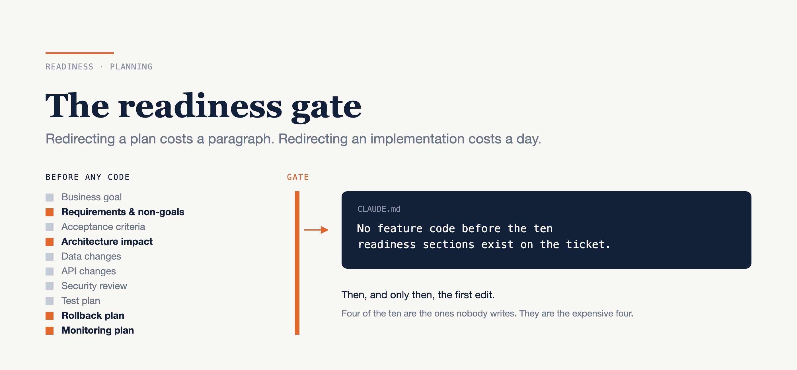

# The Readiness Gate Is the Cheapest Bug Fix You Own

### Three planning surfaces, a ten-section checklist, and why agents make underspecified tickets more expensive, not less

*Written against Claude Code in September 2026. Mode names, flags and availability move between releases, and some of what follows is plan-gated — check your own version and your organisation's settings rather than trusting a blog post from months ago.*



---

Here is a ticket, in full:

> **PROJ-1234** — Improve the checkout retry behaviour. Users are complaining.

An agent turned that into four hundred lines across nine files in about ten minutes. The work was competent. It added exponential backoff, a circuit breaker and a metrics counter. The first comment in review was "this isn't what we needed" — the complaints were about double-charging, not about retries failing.

Nobody was lazy. That ticket has been written by good engineers on every team I have worked with. What changed is that it used to sit in someone's queue for a day while they worked out what it meant, and now it gets implemented before lunch.

So the honest version: an underspecified ticket used to be a slow disaster, and now it is a fast one. The ambiguity did not get cheaper. It moved from "asked on day one" to "discovered in review on day three," which is the most expensive place it can be found. **The readiness gate exists because redirecting a plan costs one paragraph and redirecting an implementation costs a day.**

Below: why speed changed the economics, the three planning surfaces and when each fits, the ten sections a ticket needs before code, the case where all ten are the wrong answer, and how to stop relying on yourself to remember.

---

## Speed changed the economics of ambiguity

A human implementer is a natural gate, and not because they are careful. It is because writing code is expensive *for them*. Faced with "improve the checkout retry behaviour," a person spends about four seconds deciding they don't want to write four hundred lines on a guess, and asks. The question arrives on day one, costs a Slack message, and the ticket gets fixed before anything is built.

An agent has no such incentive. Producing the code is nearly free, so nothing in its position pushes back toward the question. It does what a capable contractor with no phone number would do: it fills the gaps with plausible assumptions and keeps going. Retries were a plausible reading of that ticket. It just wasn't the right one, and there was no moment in the process where anyone was forced to notice.

This is the part I think people get backwards. Agents are often sold as removing the need for detailed specifications, because you can iterate so quickly. The opposite is true. The specification mattered *less* when implementation was slow, because slowness itself surfaced the questions. Take the slowness away and you have to put the gate back deliberately.

Which is the whole idea: the question a human implementer would have asked has to become something explicit, written down, and checkable — because nothing in the loop will ask it for you any more.

---

## Three planning surfaces, and when each fits

There are three places to produce a plan, and they are not interchangeable. Names and shortcuts drift between releases; the shapes don't.

### A read-only planning mode

The agent investigates and proposes but cannot edit your source until you approve. In Claude Code this is plan mode: `Shift+Tab` cycles into it, `/plan` prefixes a single prompt, and a session can start there:

```bash
claude --permission-mode plan
```

It reads files and runs read-only shell commands, and edits stay blocked until you approve the plan. When the plan comes back, `Ctrl+G` opens it in your editor so you can correct it directly instead of describing the correction in prose. To make it the default for a repository, set it in `.claude/settings.json`:

```json
{ "permissions": { "defaultMode": "plan" } }
```

*Use it for the everyday case: a ticket you mostly understand, in a repository you know.*

### A dedicated planning subagent

An architect role in its own context window that returns a step-by-step plan and the list of files that will change, and holds no write tools at all. It is a markdown file in `.claude/agents/`:

```markdown
---
name: architect
description: Produce an implementation plan and the list of critical files. Never edits.
tools: Read, Glob, Grep
model: opus
permissionMode: plan
---

Return a step-by-step plan and the files each step touches...
```

Two things make this different from plan mode rather than a duplicate of it. The `tools:` line is an allowlist, so the inability to edit is structural rather than a mode you can cycle out of by accident. And it runs in a separate window, so the two hundred files it reads to produce six lines of plan never enter your session — you get the six lines.

*Use it when the investigation is large and you want your own context to stay clean.*

### Plan locally, execute in the cloud

For a migration or a cross-repository change, plan where you can argue with it and execute where you don't have to watch. The documented shape is: plan in the terminal, commit the plan into the repository, then hand it to a cloud session.

```bash
claude --permission-mode plan
# agree the plan, save it to docs/migration-plan.md, commit, push
claude --cloud "Execute the migration plan in docs/migration-plan.md"
```

The cloud VM clones your GitHub remote at your current branch rather than your local checkout, which is why the push is not optional. `claude --teleport` pulls the session back into your terminal afterwards, branch and history included.

Two caveats before anyone builds a process on this. Cloud sessions are **in research preview** for Pro, Max and Team accounts, and for Enterprise accounts with premium or Chat + Claude Code seats — so it is plan-gated, an organisation Owner can switch it off, and it isn't available at all when Claude Code is pointed at Amazon Bedrock, Google Cloud or Microsoft Foundry. Check before you promise it to a team.

*Use it for long-horizon work you have already scoped, not for exploration.*

---

## The ten sections a ticket needs before code

This is the readiness framework a team I work with settled on, and the reason it is worth typing out is that it is not a tool. It is a template in your issue tracker.

1. **Business goal** — why this is worth doing, in one sentence.
2. **Requirements and non-goals** — what is in, and explicitly what is out.
3. **Acceptance criteria** — the conditions that make it done, written so they can be checked.
4. **Architecture impact** — which services and repositories change, and in what order.
5. **Data changes** — schema, migration, backfill.
6. **API changes** — contract, versioning, who consumes it.
7. **Security review** — authentication, authorisation, data exposure, secrets.
8. **Test plan** — what proves it works, including the negative cases.
9. **Rollback plan** — how to undo it in production, specifically.
10. **Monitoring plan** — what you will watch to know whether it worked.

Then one line in the root instruction file, so the agent enforces the gate you agreed to:

```md
No feature code before the ten readiness sections exist on the ticket.
```

Be clear-eyed about what that line is, though. An instruction file is context, not enforcement — the model weighs it against everything else in the window and usually complies. It is a strong default, not a wall. If you need a wall, that is what a `PreToolUse` hook and `permissions.deny` are for.

### The four everyone skips

Six of those sections get written because they feel like engineering. Four get skipped because they feel like paperwork, and those four are where the money is.

**Non-goals** is the one that stops scope creep, and it is the one nobody writes. "Improve the checkout retry behaviour" would have been a different ticket entirely with one line saying *not* changing the payment provider integration. Non-goals are also the cheapest section to write, because you already know them — they are the things you decided against in the meeting and never recorded.

**Architecture impact** is where cross-repository consequences surface while they are still a sentence. Written down, "this changes the API contract that the mobile app consumes" is a rollout-order decision. Not written down, it is a Thursday afternoon.

**Rollback** and **monitoring** get skipped because they read as ops concerns that come after the code. They are the opposite: they *constrain the design*. A change you cannot roll back without a data migration is a different change, and you want to know that before an agent picks the implementation, not after it has picked one that quietly makes rollback impossible.

I will admit I wrote this list and then skipped non-goals on my own ticket the following week, and got back a change that also refactored the thing next to it. The section takes ninety seconds. I did not skip it because it was expensive.

---

## The case where ten sections is the wrong answer

A one-line bug fix does not need ten sections. It needs one sentence of intent, and then let the agent work.

The gate scales with blast radius, not with ceremony. My rough split: a fix inside one file with an obvious test gets a sentence. Anything that changes a contract, a schema or a deployment gets the full ten. Everything in between gets the four that are actually load-bearing — acceptance criteria, non-goals, test plan, rollback.

If you apply all ten to everything, the checklist becomes something people fill in after the fact to satisfy a bot, and at that point you have built the bureaucracy without buying the safety. That is the failure mode I would watch for, and it is more likely than anyone skipping the process.

---

## Make the gate mechanical

The version of this that survives contact with a busy week is not "remember to check." It is a procedure that checks for you and produces the missing text.

The shape is a read-only reviewer that reads the ticket, reports which of the ten sections are missing, and drafts paste-ready prose for each gap — and never writes to the tracker:

```
Check PROJ-1234 for feature readiness. Report which sections are
missing and draft the text for each. Do not write to the tracker.
```

That last clause is the pattern worth taking away, and it recurs everywhere agents touch systems other people read:

> The agent drafts. The human publishes.

Say it in the prompt, then enforce it where the model can't talk itself out of it. Deny and ask rules accept glob patterns in the tool-name position, so a tracker connector's write tools can be closed off in `.claude/settings.json` while its read tools stay open:

```json
{
  "permissions": {
    "deny": ["mcp__tracker__create_*", "mcp__tracker__update_*"]
  }
}
```

The natural partner to the readiness gate is the same move applied one step later — making the agent commit to what "working" means before it writes the thing that has to work:

```
Write the integration test matrix for PROJ-1234 first, list the
negative cases, then implement the narrowest change that passes it.
```

Both of these are two-line prompts today. If you type either of them more than twice, commit it as a skill — a `SKILL.md` under `.claude/skills/<name>/`, where only the description line costs you context on turns you don't invoke it — and stop retyping it.

Cost, honestly: filling ten sections on a real feature ticket runs fifteen to thirty minutes, and most of that time goes into the two sections you were going to argue about in review anyway. Writing the tracker template and the reviewer procedure is one afternoon, once.

---

## The thing to keep

The gate is not there because the agent can't be trusted. It is there because the agent is fast enough that your ambiguity now ships.

Distrust would mean reading every line it writes, which does not scale and is not what anyone actually does. The gate is the opposite move: pay attention hard at one cheap moment, so you can stop paying attention during the expensive one. It is what lets you hand an agent bigger work rather than smaller.

Do this with the next ticket you pick up. Before you open an agent on it, read the ticket and ask whether a stranger could name what is explicitly *out of scope*. If they couldn't, you have found the gap — and one sentence now costs you ninety seconds instead of the day it costs in review.

---

### Sources

- [Choose a permission mode](https://code.claude.com/docs/en/permission-modes) — Anthropic
- [Configure permissions](https://code.claude.com/docs/en/permissions) — Anthropic
- [Subagents](https://code.claude.com/docs/en/sub-agents) — Anthropic
- [Use Claude Code on the web](https://code.claude.com/docs/en/claude-code-on-the-web) — Anthropic
- [How Claude remembers your project](https://code.claude.com/docs/en/memory) — Anthropic
- [Agent Skills](https://code.claude.com/docs/en/skills) — Anthropic
