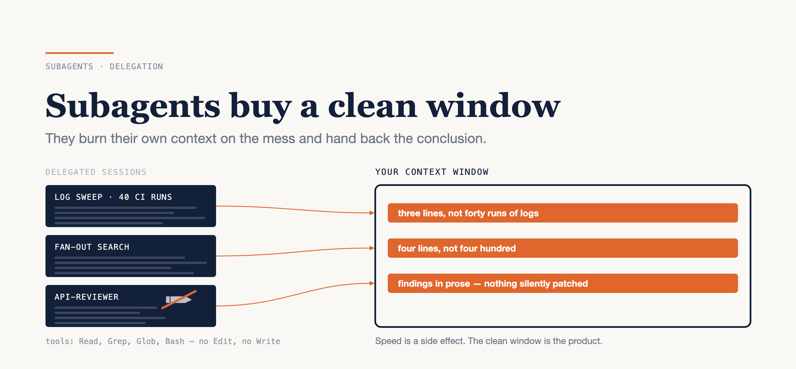

# Subagents Buy Context Isolation, Not Speed

### And a reviewer with no ability to edit is strictly better than one that can fix things for you.

*Written against Claude Code in September 2026, with every command and frontmatter field checked against the current documentation rather than my own notes. Flags move between releases; check them against your version. The repository names are placeholders for a real client stack, and the architectural constraints are the real ones.*



---

Somebody tries subagents, runs four at once, and comes back with this:

> "It took longer than doing it myself and it cost twice as much."

They measured the right thing and drew the wrong conclusion.

Here is the honest version, before the argument. Subagents are frequently not faster. Every delegated worker pays a startup cost, runs its own context window, and bills you for all of it — the documentation says outright that running several at once multiplies token usage. If you reached for delegation to make the afternoon shorter, you mostly bought tokens.

What you actually bought is different, and it is worth more. **A subagent burns its own context window on the messy part and hands you back only the conclusion.** Say you want to know why one integration test fails about one run in five. The evidence is in forty CI runs of a few thousand lines each. Answered in your own session, that is tens of thousands of lines of log sitting in your window for the rest of the day, weighted exactly as heavily as the file you actually care about. Delegated, it is three lines. Same answer. Completely different cost for everything you do next.

So: what delegation is really for, what a subagent file looks like and the one field in it that matters most, how to turn the routing rules your team already wrote down into committed reviewers this week, and the four parallelism surfaces that keep getting discussed as one thing.

---

## What you are actually buying

Everything the model can see when it decides is finite, and it only ever grows over a session. You control some of it directly — the instruction files you commit are just files. You control much less of the rest, because the agent chooses most of what it reads. Delegation is the only move that removes volume while keeping the conclusion.

Three situations where it is clearly the right call:

- **The side task would flood your window.** Search hits, log output, a dependency tree, forty files read to answer one question. If the answer is four lines and the process is four hundred, that process belongs in someone else's window.
- **You want a second opinion that has not read your reasoning.** This is the underrated one. A fresh subagent reviewing your diff has not seen you talk yourself into the approach, so it cannot be anchored by it. When you want the opposite — a critic who *has* followed your reasoning — that is a different tool, and there is one: `/subtask` forks the current conversation into a subagent that inherits your full context instead of starting fresh.
- **You need the same specialist judgement repeatedly.** At that point it should stop being a prompt you retype and become a file in `.claude/agents/` that the whole team gets on their next pull.

And the case where delegation is wrong, which most write-ups skip: a small task you already have the context for is cheaper done inline. If you have the file open and the question is about that file, asking a fresh worker to go find it again costs you a startup, a re-read and a summary to get back something you could have read yourself. Delegation pays when the ratio of noise to conclusion is high. When it's low, it's overhead with extra steps.

---

## Anatomy of a subagent you commit

A subagent is a markdown file with frontmatter. Project-scoped ones live in `.claude/agents/` and get checked into the repository; personal ones live in `~/.claude/agents/` and follow you across projects. Here is a complete one:

```md
---
name: api-reviewer
description: Review rest-api changes for authorization gaps,
  DTO over-exposure, and impact on existing callers.
tools: Read, Grep, Glob, Bash
model: inherit
---

Read the repository's instruction file, then the touched resources
and the service classes behind them.

Report findings only. Do not edit anything.
```

Three fields are doing the real work, and they are not equally important.

**`tools:` is the one that matters.** It is an allowlist — omit it and the subagent inherits everything you have, including `Edit` and `Write`. There is a `disallowedTools` denylist if you'd rather subtract than enumerate. Now the argument for using it: a reviewer that can edit *will* edit. It finds the problem and helpfully fixes it, and the finding vanishes into a diff. A finding that vanishes into a diff is a finding nobody on your team learned. Take the edit tools away and the only move left is to write it down. That is not a security control, it is an editorial one — you are forcing the output to be prose. It is also the single change that made review subagents useful to me rather than mildly alarming.

**`model:` matches cost to task.** It takes a family alias, a full model ID, or `inherit` to follow your session. Use `inherit` for judgement work where the reviewer needs to be as sharp as you are. Pin something cheaper for mechanical sweeps — "list every file that imports this module" does not need your best model. For a blanket default across every subagent, `CLAUDE_CODE_SUBAGENT_MODEL=haiku` in your environment sets one without touching any file.

**`description:` is routing, not documentation.** It is the text the main agent reads when deciding whether this specialist is the right one to hand the task to. Written as a label — "API reviewer" — it gives the router nothing to match on beyond the name. Written as a set of conditions, it says when this specialist is the right one. Say what the agent is for *and when to reach for it*.

Worth knowing before you start writing your own: several roles ship built in. There is a read-only one for fan-out search across a codebase, a read-only one for research before planning, and a general-purpose one with the full tool set. Check those first — a lot of custom agents are a worse version of `Explore`.

---

## Turn your routing notes into reviewer files

Most teams have already done the hard part of this and don't know it. Somewhere — a wiki page, an onboarding doc, a pinned message — is a list of which parts of the system need which kind of scrutiny. It reads roughly like this:

| Repository | Stack | What a reviewer must know |
|---|---|---|
| `web-app` | Angular with SSR | services own API calls, components only render; guard and resolver changes need navigation and auth tests |
| `marketing-site` | Astro, static-first | CMS content resolves at build time, i18n is static, SEO and accessibility are validated |
| `rest-api` | Java and Spring Boot | resources stay thin, business rules live in the domain service layer, persistence stays isolated |
| `admin-app` | Angular admin panel | API access is confined to the core layer and page facades |
| `mobile-app` | Flutter | features isolated per directory, routing and design system shared in the app layer |
| `infra` | Kubernetes manifests | dry-run first, never touch live state without approval |

That table is a set of subagent definitions that nobody has written down as files. The whole point is that the knowledge already exists and is currently being applied by whoever happens to review the PR.

Here is the conversion, and it is genuinely one afternoon:

### 1. Take one row

Start with the repository where bad reviews hurt most. For most teams that is the API.

### 2. Write the file

`.claude/agents/api-reviewer.md`, with the "what a reviewer must know" column as the body. Prose, not bullets — it is a brief for a colleague.

### 3. Give it read tools only

`tools: Read, Grep, Glob, Bash`. Then add the line that makes the restriction legible to the agent as well as enforced: *Report findings only. Do not edit.*

### 4. Make the description a trigger, not a title

"Review `rest-api` changes for authorization gaps, DTO over-exposure, and impact on existing callers" gets routed to correctly. "Backend code reviewer" does not.

### 5. Run it against a merged PR you already reviewed by hand

This is the step people skip and it is the only real test. You know what the human review found. If the agent finds three of those four things plus one you missed, commit the file. If it finds nothing, your body text is a job title rather than a brief — rewrite it and run it again.

### 6. Commit it, then do the next row

It is a file in the repository. Everyone gets it on their next pull, and it gets reviewed like code when someone changes it.

Two rows is about ninety minutes including the verification runs. Six rows is an afternoon. The cross-repository discipline that goes with it is unchanged from the human version: one branch per repository, the dependency between them recorded in the PR description, and the rollout order agreed before anyone writes code.

---

## Four ways to parallelise, and they are not interchangeable

These get discussed as one topic. They are four, and they differ on three axes: who coordinates the work, whether the workers talk to each other, and whether they touch the same files.

| Surface | What it gives you | Reach for it when |
|---|---|---|
| Subagents | delegated workers inside one session that return a summary | a side task would flood your main window |
| Background sessions | a screen for dispatching and monitoring independent sessions, opened with `claude agents` | you have several unrelated tasks to hand off and check on later |
| Agent teams | a lead plus teammates with a shared task list and direct messaging | you want the agent to split a project, assign it and supervise |
| Dynamic workflows | a script driving many subagents and cross-checking their results | a codebase-wide audit or a large mechanical migration |

Two things matter more than the table.

**Isolation is a separate decision from parallelism.** Worktrees are what actually stop parallel work from colliding: `claude --worktree feature-auth` puts the session in its own checkout under `.claude/worktrees/`, on its own branch, with its own files. A subagent can have one too — `isolation: worktree` in the frontmatter makes it permanent for that agent. The detail that bites people immediately: a worktree needs a git repository, so in a workspace holding six independent repositories they apply per repository, not at the root. The root is not a repository and the failure is not as clear as you'd like. And because a worktree is a fresh checkout, your `.env` isn't in it — a `.worktreeinclude` file at the project root copies gitignored files into every new one.

**Coordination is not free, and agent teams say so out loud.** They are experimental and disabled by default; you turn them on with `CLAUDE_CODE_EXPERIMENTAL_AGENT_TEAMS=1`. More to the point, teammates are *not* isolated in worktrees, which means two of them editing the same file overwrite each other. Partition the work by file owner explicitly, in the spawn prompt, or don't use a team. The token guidance in the docs is blunt: usage scales with the number of active teammates, and for routine work a single session is more cost-effective. Parallelism is a wall-clock optimisation. You pay for it in money, and you pay for it in the coordination you now have to do.

---

## Two session controls that change how you work

There is a long list of session flags and it dates badly. Two of them are worth the paragraph.

**Rewind.** `/rewind`, or `Esc` twice on an empty prompt, opens a menu of every prompt you sent and lets you restore the code, the conversation, or both. This matters psychologically more than technically — it removes the fear that makes people review every single edit as it lands. Know the holes before you rely on it: changes made by bash commands aren't tracked, so an `mv` or an `rm` is not coming back, and edits made by most subagents aren't restored either. Use git for those.

**A completion condition.** `/goal all tests in test/auth pass and the lint step is clean` sets a condition, and after each turn a small fast model checks whether it holds; if it doesn't, the agent takes another turn instead of handing control back. This replaces the most common failure in a long session, which is the agent declaring victory early. Write the condition as something the transcript can demonstrate — the evaluator reads the conversation, it doesn't run your tests itself — and bound it, with a clause like "or stop after 20 turns", so a bad condition can't spin. `/goal clear` ends it.

Four more in a sentence each. `claude --model opusplan` plans on Opus and switches to Sonnet to execute. `/effort` dials reasoning depth from `low` up to `max`, which is a cost lever as much as a quality one. `/branch` copies the conversation so you can try a second approach without losing the first. And `claude -n auth-refactor` names a session so `claude --resume auth-refactor` finds it three days later. Availability varies by version and plan, so check yours rather than trusting this list.

---

## The thing to keep

Subagents are a context technique wearing a performance costume.

Delegate when the noise-to-conclusion ratio is high, and skip it when you already have the context. Restrict the tools so findings get written down instead of silently patched. Parallelise deliberately, isolate with worktrees when the workers share files, and go in knowing you are trading money for wall-clock time.

The thing to do this week is the smallest one: take a single line from your team's review notes, write it into `.claude/agents/` with `tools: Read, Grep, Glob, Bash` and nothing else, and run it against a PR you already reviewed by hand. If it catches something you missed, you have found an afternoon's work worth doing. If it catches nothing, you have learned that your review notes are thinner than everyone assumed — which is the more useful finding, and you'd rather have it now.

---

### Sources

- [Subagents](https://code.claude.com/docs/en/sub-agents) — Claude Code documentation
- [Run agents in parallel](https://code.claude.com/docs/en/agents) — Claude Code documentation
- [Run parallel sessions with worktrees](https://code.claude.com/docs/en/worktrees) — Claude Code documentation
- [Orchestrate teams of Claude Code sessions](https://code.claude.com/docs/en/agent-teams) — Claude Code documentation
- [Checkpointing](https://code.claude.com/docs/en/checkpointing) — Claude Code documentation
- [Keep Claude working toward a goal](https://code.claude.com/docs/en/goal) — Claude Code documentation
- [Model configuration](https://code.claude.com/docs/en/model-config) — Claude Code documentation
